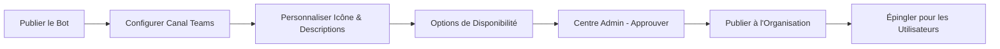

# 📢 Guide de Publication - Bot Traducteur dans Teams

## 📋 Vue d'ensemble

Ce guide détaille la publication officielle du Bot Traducteur dans Microsoft Teams pour le rendre accessible à toute l'organisation.

**Durée estimée** : 15-20 minutes  
**Prérequis** : 
- Bot déployé et testé dans Copilot Studio
- Compte administrateur Microsoft 365
- Icône du bot préparée (format PNG recommandé, 192x192px minimum)

---

## 🎯 Processus de Publication - Vue d'ensemble



---

## 📝 Descriptions du Bot

### Description Courte (250 caractères max)
```
Agent gérant la traduction de document
```

### Description Moyenne (500 caractères max)
```
Notre bot de traduction d'entreprise, propulsé par le service Azure Translator, offre une solution efficace pour traduire vos documents tout en préservant leur mise en forme originale. Compatible avec plus de 100 langues, il prend en charge une variété de formats de fichiers, notamment :

- Documents Microsoft Word (.docx)
- Présentations Microsoft PowerPoint (.pptx)
- Documents PDF (.pdf)
- Fichiers HTML (.html, .htm)
- Messages Outlook (.msg)
- Formats OpenDocument tels que Texte (.odt), Présentation (.odp) et Feuille de calcul (.ods)
- Fichiers texte brut (.txt)
- Formats de données délimitées comme CSV (.csv) et TSV (.tsv, .tab)
- Format de texte enrichi (.rtf)

Notre bot assure la conservation de la structure et du formatage de vos documents originaux, garantissant ainsi des traductions précises sans compromettre la présentation. De plus, il est capable de détecter automatiquement la langue source de vos documents, simplifiant ainsi le processus de traduction.

Pour des besoins spécifiques, notre bot peut également utiliser des glossaires personnalisés aux formats CSV, TSV ou XLIFF, afin d'adapter les traductions à la terminologie propre à votre entreprise.

En résumé, notre bot de traduction d'entreprise est une solution complète et fiable pour répondre à tous vos besoins en matière de traduction de documents.
```

---

## 🚀 PARTIE 1 : Publication du Bot

### ÉTAPE 1 : Publier le Bot dans Copilot Studio

1. **Ouvrir Copilot Studio**
   - Aller sur : https://copilotstudio.microsoft.com
   - Se connecter avec le compte de déploiement
   - Sélectionner le bon environnement

2. **Ouvrir le Bot Traducteur**
   - Cliquer sur **"Assistants"** dans le menu de gauche
   - Ouvrir le **Bot Traducteur** (ou `crf4a_assistant1`)

3. **Lancer la Publication**
   - Cliquer sur **"Publier"** en haut à droite
   - Confirmer la publication
   - Attendre 2-3 minutes que la publication soit terminée
   - ✅ Vérifier que le statut indique "Publié"

---

## 📱 PARTIE 2 : Configuration du Canal Teams

### ÉTAPE 2 : Accéder aux Canaux

1. Dans le Bot Traducteur (Copilot Studio)
2. Cliquer sur **"Canaux"** dans le menu de gauche
3. Localiser **"Microsoft Teams et Microsoft 365 Copilot"**
4. Cliquer sur **"Teams"**

### ÉTAPE 3 : Créer le Canal Teams

1. Cliquer sur **"Créer un canal"** ou **"Configurer"**
2. Une interface de configuration s'ouvre


**Dans cette interface, vous verrez :**
- ✅ Case à cocher : **"Rendre assistant disponible dans Microsoft 365 Copilot"**
- Section **"Version préliminaire de l'Assistant"** avec le nom "Traducteur"
- Bouton **"Modifier les détails"** pour personnaliser
- **Options de disponibilité** : Choix entre affichage limité ou organisation entière
- **Afficher assistant dans Microsoft 365** et **Afficher assistant dans Teams**

---

## 🎨 PARTIE 3 : Personnalisation

### ÉTAPE 4 : Personnaliser l'Apparence

#### A. Modifier les Détails

1. **Cliquer sur "Modifier les détails"** (voir capture ci-dessus)
2. Une fenêtre de personnalisation s'ouvre

#### B. Icône du Bot

1. **Télécharger l'icône**
   - Cliquer sur **"Télécharger une icône"** / **"Upload icon"**
   - Sélectionner le fichier : `images/bot-icon.png`
   - Format recommandé : PNG, 192x192px minimum
   - ✅ L'icône s'affichera dans Teams

> **Note** : L'icône sera visible par tous les utilisateurs dans Teams et Microsoft 365.

#### C. Description Courte

1. Localiser le champ **"Description courte"** / **"Short description"**
2. Copier-coller :
```
Agent gérant la traduction de document
```

#### D. Description Moyenne

1. Localiser le champ **"Description"** ou **"Description longue"**
2. Copier-coller la description moyenne complète (voir section "Descriptions du Bot" ci-dessus)

#### E. Informations Développeur

1. Localiser la section **"Plus"** ou **"Informations développeur"**
2. Dans le champ **"Nom du développeur"** / **"Developer name"** :
```
Be-Cloud
```

3. *(Optionnel)* Ajouter un site web :
```
https://be-cloud.com
```

4. *(Optionnel)* Ajouter une politique de confidentialité et conditions d'utilisation

5. **Enregistrer les modifications**

---

## 🌍 PARTIE 4 : Options de Disponibilité

### ÉTAPE 5 : Configurer la Disponibilité


**Dans cette section, vous avez deux options :**

#### Option 1 : Afficher à mes collègues et aux utilisateurs partagés
- S'affiche dans **"Créé avec Power Platform"**
- Limité aux utilisateurs que vous sélectionnez
- ❌ Pas recommandé pour un déploiement organisation entière

#### Option 2 : ✅ **Afficher à tous les membres de mon organisation** (RECOMMANDÉ)
- S'affiche dans **"Créé par votre organisation"** après approbation de l'administrateur
- ✅ **Cocher "Disponible dans l'App Store"**
- Visible pour toute l'organisation
- Nécessite une approbation admin

**Étapes :**

1. Dans la section **"Afficher dans le magasin"**
2. Sélectionner l'option :
   ```
   ☑️ Afficher à tous les membres de mon organisation
   ```
3. ✅ Cocher **"Disponible dans l'App Store"**
4. Le texte indique : *"S'affiche dans Créé par votre organisation après approbation de l'administrateur"*
5. Cliquer sur **"Enregistrer"** / **"Save"**

---

## 📤 PARTIE 5 : Obtenir le Lien et Soumettre

### ÉTAPE 5B : Options de Partage

Après avoir configuré la disponibilité, vous verrez plusieurs options :

#### 🔗 **Obtenir un lien**
- Les utilisateurs sélectionnés peuvent ouvrir votre assistant dans Microsoft Teams avec ce lien
- Bouton **"Copier le lien"**
- Utile pour partage direct

#### 📦 **Télécharger un fichier**
- Téléchargez votre fichier pour ajouter votre assistant au magasin Microsoft Teams ou Microsoft 365
- Bouton **"Télécharger .zip"**
- Pour installation manuelle

#### 🏪 **Afficher dans le magasin**
- Choisir qui peut voir votre assistant
- **Option recommandée :** "Afficher à tous les membres de mon organisation"
- Nécessite approbation admin

**Action :** Cliquer sur **"Soumettre pour approbation"** si un bouton apparaît

---

## 🔐 PARTIE 5 : Approbation Admin (Centre d'administration)

### ÉTAPE 6 : Accéder au Centre d'Administration

> **Important** : Cette étape nécessite un compte **Administrateur Microsoft 365**

1. **Se connecter au Centre d'Administration Teams**
   - Ouvrir un nouvel onglet
   - Aller sur : https://admin.teams.microsoft.com
   - Se connecter avec le compte **admin** (avec privilèges d'administrateur)

2. **Naviguer vers les Applications**
   - Dans le menu de gauche, cliquer sur **"Applications Teams"**
   - Puis cliquer sur **"Gérer les applications"** / **"Manage apps"**

   **OU**

   - Aller sur le Centre d'Administration général : https://admin.microsoft.com
   - Cliquer sur **"Afficher tout"**
   - Aller dans **"Teams"**
   - Puis **"Applications Teams"** → **"Gérer les applications"**

### ÉTAPE 7 : Trouver et Approuver le Bot

1. **Filtrer les Applications**
   - Cliquer sur **"État d'approbation"** / **"Approval status"**
   - Sélectionner **"En attente d'approbation"** / **"Pending approval"**
   - OU utiliser la barre de recherche et taper "Bot Traducteur" ou "Agent traduction"

2. **Sélectionner le Bot**
   - Localiser **"Bot Traducteur"** ou **"Agent gérant la traduction"**
   - Cliquer sur le nom du bot pour ouvrir les détails

3. **Examiner les Détails**
   - Vérifier les permissions demandées
   - Vérifier la description
   - Vérifier le développeur (Be-Cloud)

---

## ✅ PARTIE 6 : Publication à l'Organisation

### ÉTAPE 8 : Publier et Configurer l'Étendue

1. **Publier l'Application**
   - Cliquer sur **"Publier"** / **"Publish"** en haut
   - Ou cliquer sur **"Autoriser"** / **"Allow"**
   - Une fenêtre de configuration s'ouvre

2. **Sélectionner l'Étendue de Publication**
   - Option : **"Disponible pour tout le monde"** / **"Available to everyone"**
   - OU **"Organisation entière"** / **"Entire organization"**
   - Confirmer en cliquant sur **"Suivant"** / **"Next"**

3. **Confirmer la Publication**
   - Cliquer sur **"Publier"** / **"Publish"**
   - ✅ Le bot est maintenant publié à toute l'organisation !

---

## 📌 PARTIE 7 : Épingler le Bot (Recommandé)

### ÉTAPE 9 : Épingler pour les Utilisateurs

L'épinglage facilite l'accès au bot pour vos utilisateurs.

1. **Retourner aux Détails du Bot**
   - Dans le Centre d'Administration Teams
   - Applications Teams → Gérer les applications
   - Chercher et ouvrir "Bot Traducteur"

2. **Configurer les Stratégies d'Épinglage**
   - Cliquer sur l'onglet **"Affectations"** / **"Assignments"**
   - OU chercher **"Stratégies de configuration de l'application"** / **"App setup policies"**

3. **Ajouter une Stratégie d'Épinglage**
   - Cliquer sur **"Ajouter des utilisateurs"** / **"Add users"**
   - Ou modifier la stratégie **"Global (Par défaut pour toute l'organisation)"**

4. **Configurer l'Épinglage**
   - Cliquer sur **"Applications épinglées"** / **"Pinned apps"**
   - Cliquer sur **"+ Ajouter des applications"**
   - Rechercher **"Bot Traducteur"**
   - Sélectionner et cliquer sur **"Ajouter"**
   
5. **Définir l'Étendue d'Épinglage**
   - Sélectionner l'étendue : **"Organisation entière"** / **"Entire organization"**
   - Ou choisir des groupes/utilisateurs spécifiques

6. **Définir la Position**
   - Déplacer le bot dans la liste pour choisir sa position d'épinglage
   - Position 1 = Première icône visible dans la barre latérale Teams

7. **Enregistrer**
   - Cliquer sur **"Enregistrer"** / **"Save"**
   - ✅ Le bot sera automatiquement épinglé pour les utilisateurs sélectionnés

> **Note** : La propagation de l'épinglage peut prendre jusqu'à 24 heures

---

## 🎉 Publication Terminée !

### ✅ Résumé des Actions Réalisées

- ✅ Bot publié dans Copilot Studio
- ✅ Canal Teams configuré
- ✅ Icône personnalisée téléchargée
- ✅ Descriptions courte et moyenne ajoutées
- ✅ Nom du développeur défini (Be-Cloud)
- ✅ Options de disponibilité configurées (toute l'organisation)
- ✅ Approbation admin accordée
- ✅ Bot publié à l'organisation entière
- ✅ Bot épinglé pour faciliter l'accès

---

## 👥 Accès Utilisateur

### Comment les Utilisateurs Accèdent au Bot

#### Option 1 : Via l'Épinglage (si configuré)
- Ouvrir Microsoft Teams
- Le bot apparaît dans la barre latérale gauche
- Cliquer sur l'icône pour démarrer une conversation

#### Option 2 : Via la Recherche
1. Ouvrir Microsoft Teams
2. Cliquer sur **"Applications"** en bas de la barre latérale
3. Rechercher **"Bot Traducteur"** ou **"Agent traduction"**
4. Cliquer sur le bot
5. Cliquer sur **"Ajouter"** / **"Add"**
6. Le bot s'ouvre dans une nouvelle conversation

#### Option 3 : Via un Lien Direct
Partager le lien direct du bot (disponible dans Copilot Studio → Canaux → Teams)

---

## 📊 Vérifications Post-Publication

### Checklist Admin

- [ ] Bot visible dans le Centre d'Administration Teams
- [ ] Statut du bot : **"Autorisé"** / **"Allowed"**
- [ ] Disponibilité : **"Toute l'organisation"**
- [ ] Épinglage configuré (si souhaité)
- [ ] Permissions vérifiées et acceptables

### Checklist Utilisateur (Test)

- [ ] Ouvrir Teams avec un compte utilisateur standard
- [ ] Rechercher le bot dans "Applications"
- [ ] Le bot apparaît dans les résultats
- [ ] Cliquer sur "Ajouter"
- [ ] Conversation démarre correctement
- [ ] Tester un upload de document
- [ ] Vérifier que la traduction fonctionne

---

## 🔧 Troubleshooting

### Le bot n'apparaît pas dans Teams

**Causes possibles :**
1. Pas encore publié par l'admin
2. Stratégie d'application bloquante
3. Propagation en cours (attendre 24h max)

**Solutions :**
1. Vérifier dans le Centre Admin que le bot est "Autorisé"
2. Vérifier les stratégies d'application Teams
3. Forcer la synchronisation : Déconnexion/reconnexion Teams

### Les utilisateurs ne voient pas le bot épinglé

**Causes :**
- Stratégie d'épinglage pas appliquée à tous
- Propagation en cours

**Solutions :**
1. Vérifier la stratégie "Global" dans le Centre Admin
2. Attendre 24h pour la propagation
3. Demander aux utilisateurs de redémarrer Teams

### Erreur "Permission refusée" lors de l'utilisation

**Cause :** Permissions du bot insuffisantes

**Solution :**
1. Aller dans Copilot Studio → Paramètres du bot → Sécurité
2. Vérifier les permissions
3. Republier le bot si changements

### Le bot répond mais ne traduit pas

**Cause :** Problème backend (Azure Function ou Translator)

**Solution :**
1. Tester l'API Azure directement :
   ```bash
   curl https://func-translation-{client}.azurewebsites.net/api/health
   ```
2. Vérifier les logs Power Automate
3. Vérifier les variables d'environnement dans la solution

---

## 📈 Suivi et Maintenance

### Surveillance de l'Utilisation

**Dans le Centre d'Administration Teams :**
1. Aller dans **"Analyse"** / **"Analytics"**
2. Sélectionner **"Utilisation des applications"** / **"App usage"**
3. Rechercher "Bot Traducteur"
4. Consulter :
   - Nombre d'utilisateurs actifs
   - Nombre de conversations
   - Tendances d'utilisation

**Dans Copilot Studio :**
1. Ouvrir le bot
2. Aller dans **"Analytique"** / **"Analytics"**
3. Consulter :
   - Sessions
   - Taux de résolution
   - Sujets les plus utilisés

### Mise à Jour du Bot

Lorsque vous mettez à jour le bot :

1. Effectuer les modifications dans Copilot Studio
2. Tester dans l'environnement de dev
3. Publier la nouvelle version
4. **Pas besoin de republier dans Teams** - la mise à jour est automatique
5. Informer les utilisateurs des nouvelles fonctionnalités

### Gestion des Retours Utilisateurs

1. **Créer un canal de feedback :**
   - Équipe Teams dédiée
   - Email support
   - Formulaire Forms

2. **Suivre les incidents :**
   - Logs Power Automate pour erreurs techniques
   - Conversations Copilot Studio pour problèmes UX

3. **Amélioration continue :**
   - Analyser les sujets non compris
   - Enrichir les réponses
   - Ajouter des FAQ

---

## 📚 Ressources et Liens

### Portails d'Administration

- **Centre Admin Teams** : https://admin.teams.microsoft.com
- **Centre Admin Microsoft 365** : https://admin.microsoft.com
- **Copilot Studio** : https://copilotstudio.microsoft.com
- **Power Platform Admin** : https://admin.powerplatform.microsoft.com

### Documentation Microsoft

- **Gérer les applications Teams** : https://learn.microsoft.com/microsoftteams/manage-apps
- **Stratégies d'applications** : https://learn.microsoft.com/microsoftteams/app-policies
- **Publier un bot personnalisé** : https://learn.microsoft.com/microsoft-copilot-studio/publication-add-bot-to-microsoft-teams

### Support

- **Support Microsoft Teams** : https://support.microsoft.com/teams
- **Support Copilot Studio** : https://learn.microsoft.com/microsoft-copilot-studio

---

## 💡 Bonnes Pratiques

### Communication aux Utilisateurs

**Annonce de Lancement :**
```
📢 Nouveau : Bot Traducteur disponible dans Teams !

Nous sommes ravis d'annoncer le lancement de notre Bot Traducteur d'entreprise, maintenant disponible directement dans Microsoft Teams.

🌍 Plus de 100 langues supportées
📄 Supporte Word, PowerPoint, PDF et bien plus
🎯 Conservation du formatage original

Comment l'utiliser :
1. Chercher "Bot Traducteur" dans Teams
2. Cliquer sur "Ajouter"
3. Envoyer votre document et choisir la langue

Besoin d'aide ? Contactez le support IT.
```

**Guide Utilisateur Rapide :**
1. Créer un PDF d'une page avec captures d'écran
2. Partager dans Teams et par email
3. Organiser une session de démonstration

### Gouvernance

- **Revue trimestrielle** : Analyser l'utilisation et les retours
- **Mises à jour régulières** : Améliorer le bot basé sur les feedbacks
- **Documentation** : Maintenir à jour les guides utilisateurs
- **Formation** : Sessions pour nouveaux arrivants

---

## ✅ Validation Finale

Avant de considérer la publication comme terminée, vérifier :

### Tests Admin
- [ ] Bot publié et visible dans le Centre Admin
- [ ] Autorisations correctement configurées
- [ ] Épinglage fonctionnel (si configuré)

### Tests Utilisateur
- [ ] Un utilisateur standard peut trouver le bot
- [ ] Un utilisateur peut ajouter le bot
- [ ] Un utilisateur peut converser avec le bot
- [ ] Un utilisateur peut télécharger et traduire un document
- [ ] Le document traduit est téléchargeable

### Documentation
- [ ] Guide utilisateur préparé
- [ ] Annonce de lancement rédigée
- [ ] Plan de support défini
- [ ] Formation planifiée (si nécessaire)

---

## 🎉 Félicitations !

Votre **Bot Traducteur** est maintenant **publié et accessible** à toute votre organisation dans Microsoft Teams !

Les utilisateurs peuvent désormais traduire leurs documents facilement, directement depuis leur environnement de travail quotidien.

---

**Guide créé le** : 2026-01-08  
**Version** : 1.0  
**Auteur** : Équipe Be-Cloud  
**Dernière mise à jour** : 2026-01-08
